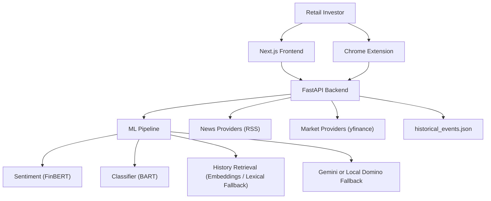
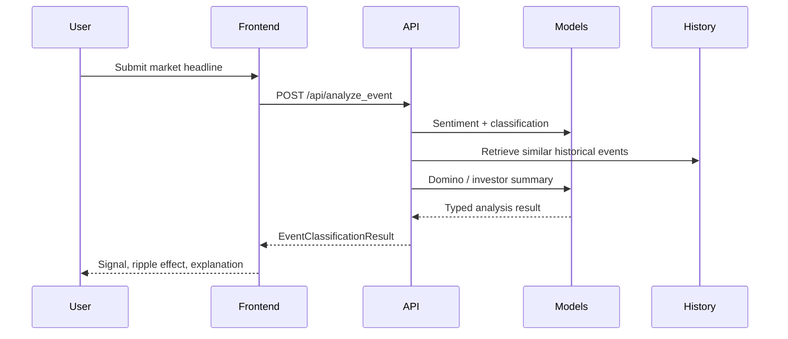

# 🇮🇳 Finora - AI Market Intelligence for Indian Retail Investors

[](https://nextjs.org/)
[](https://fastapi.tiangolo.com/)
[](https://pytorch.org/)
[](https://developer.chrome.com/docs/extensions/)
[](LICENSE)

An India-first market intelligence platform that transforms headlines into sector signals, historical analogs, portfolio stress tests, and beginner-friendly explanations across a web app, backend ML API, and Chrome extension.


---

## ✨ Key Features

### 📈 Event Intelligence
- Headline-to-market analysis with sentiment, classification, and signal scoring
- Historical parallel search backed by local event data and fallback-safe retrieval
- Domino and ripple impact chains for sector-level consequences
- Beginner-friendly explanation layers for non-expert users

### 📰 Live News Intelligence
- Real-time market news feed from Indian financial sources
- Search, sort, pagination, loading, empty, and error states
- Story-to-market impact summaries and coach-style briefs
- Deep-dive routing from live headlines into the event analysis workflow

### 💼 Portfolio Coach
- Stress-test holdings against live or typed-in macro events
- Dynamic sector, risk appetite, and holdings forms
- Estimated rupee impact bands and guidance summaries
- Polished portfolio snapshot UI for quick review before execution

### 🌍 Market Explorer
- Live market snapshots and charting views
- Sector monitoring and exploratory prediction panels
- Graceful fallback behavior when external data providers are unavailable
- Responsive dashboard layout across desktop and mobile

### 🧩 Chrome Extension
- Analyze the article currently open in the browser
- Pull live market news from the backend
- Run portfolio stress workflows from the popup
- Open the full Finora deep-dive in the web app

### 🛡 Reliability & Security
- Typed API contracts and structured error envelopes
- Pagination for long list endpoints
- Per-IP rate limiting on expensive routes
- Secure response headers and environment-based configuration
- Fallback-safe ML/runtime behavior when Gemini, Hugging Face, RSS, or yfinance fail

---

## 🚀 Quick Start

### Prerequisites
- Python 3.10+
- Node.js 18+
- A virtual environment
- Optional: NVIDIA CUDA setup for GPU inference
- Optional: Gemini API key for premium AI explanations

```bash
# Clone repository
git clone <your-repo-url>
cd Finora

# Create and activate a virtual environment
python -m venv venv
```

Activation:

```bash
# Windows
venv\Scripts\activate

# Linux / macOS
source venv/bin/activate
```

Install dependencies:

```bash
pip install -r requirements.txt
cd finora_frontend
npm install
cd ..
```

### Configure environment

Create a root `.env` file from `.env.example`:

```env
HF_TOKEN=your_huggingface_token
HUGGINGFACE_HUB_TOKEN=
GEMINI_API_KEY=your_google_ai_studio_key
GOOGLE_API_KEY=
GEMINI_MODEL=gemini-2.5-flash
UPSTOX_ACCESS_TOKEN=
NEWS_API_KEY=
ALLOW_ALL_CORS=0
ALLOWED_ORIGINS=http://localhost:3000,http://127.0.0.1:3000
ENABLE_MODEL_FALLBACKS=1
MODEL_WARMUP_ON_STARTUP=0
DISABLE_CUDA=0
FORCE_RESEED_CHROMA=0
```

Create `finora_frontend/.env.local`:

```env
NEXT_PUBLIC_API_URL=http://localhost:8000
```

### Start the backend

```bash
uvicorn finora_ml.api:app --reload --host 127.0.0.1 --port 8000
```

### Start the frontend

```bash
cd finora_frontend
npm run dev
```

### Load the Chrome extension

1. Open `chrome://extensions`
2. Enable `Developer mode`
3. Click `Load unpacked`
4. Select the `finora_extension` folder

**Access Endpoints**
- Web App: `http://localhost:3000`
- Backend API: `http://localhost:8000`
- Health Check: `http://localhost:8000/api/health`
- Runtime Status: `http://localhost:8000/api/system/status`
- API Docs: `http://localhost:8000/docs`

---

## 🌐 System Overview

### Architecture Diagram


### Data Flow


---

## 🛠 Technology Stack

| Component | Technologies |
|-----------|--------------|
| **Frontend** | Next.js 16, React 19, TypeScript, Tailwind CSS, React Query, Framer Motion |
| **Backend** | FastAPI, Pydantic v2, Uvicorn |
| **ML / NLP** | PyTorch, Transformers, Sentence Transformers |
| **Data Layer** | ChromaDB, local historical event JSON |
| **Market / News** | yfinance, RSS feeds |
| **Extension** | Chrome Extension Manifest V3, Vanilla JavaScript |
| **Validation** | Zod (frontend), Pydantic (backend) |

---

## 📂 Repository Structure

```text
Finora/
├── finora_ml/
│   ├── api/               # FastAPI app, routes, middleware
│   ├── infra/             # Rate limiting, HTTP helpers
│   ├── models/            # Sentiment, classifier, Gemini, embeddings
│   ├── providers/         # RSS + market provider integrations
│   ├── services/          # Runtime, predictions, portfolio, news services
│   ├── features/          # History echo and persona logic
│   ├── schemas.py         # Shared API/ML contracts
│   └── test_pipeline.py   # Backend regression tests
├── finora_frontend/
│   ├── app/               # App Router pages
│   ├── components/        # Shared and feature-specific UI
│   ├── features/          # Event, market, news feature modules
│   ├── hooks/             # React Query and app hooks
│   ├── lib/               # API client and schemas
│   └── services/          # Frontend API service layer
├── finora_extension/
│   ├── manifest.json
│   ├── popup.html
│   ├── popup.js
│   ├── background.js
│   └── content.js
├── historical_events.json
├── requirements.txt
├── .env.example
└── README.md
```

---

## 📝 Core Dependencies

```text
# Backend
fastapi
uvicorn
torch
transformers
sentence-transformers
chromadb
python-dotenv
yfinance
feedparser
beautifulsoup4

# Frontend
next
react
@tanstack/react-query
framer-motion
lightweight-charts
zod
lucide-react
```

---

## ✅ Verification

### Frontend
```bash
cd finora_frontend
npm run lint
npm exec tsc -- --noEmit
npm run build
```

### Backend
```bash
python -m unittest finora_ml.test_pipeline -v
```

---

## 🐛 Issue Reporting

If you find a bug or regression, open an issue with:

```markdown
## Description
[Clear explanation of the issue]

## Reproduction Steps
1. Go to...
2. Trigger...
3. Observe...

## Expected Behavior
[What should happen]

## Actual Behavior
[What actually happened]

## Environment
- OS:
- Browser:
- Python Version:
- Node Version:

## Additional Context
[Logs, screenshots, API responses]
```

Recommended labels:
- `bug`
- `feature`
- `docs`
- `performance`
- `security`

---

## 🛠 Development Roadmap

### Next Milestones
- Personalized investor profiles with saved watchlists
- Better provider caching and background refresh strategies
- Richer prediction explainability and market scenario views
- Extension quality-of-life improvements for article scraping and onboarding
- Deployment templates for frontend, backend, and extension packaging

### Contribution Guide
1. Fork the repository
2. Create a feature branch
3. Make changes with tests where relevant
4. Run verification commands
5. Open a pull request with a clear summary

### Code Standards
- Keep public API contracts typed and stable
- Prefer graceful degradation over hard failure when providers are unavailable
- Avoid dead UI and unfinished placeholder states
- Keep secrets out of source control

---

## 📦 Production Notes

- Finora is intentionally anonymous/public in this version; there is no user account or persisted portfolio system.
- `historical_events.json` is a committed source-of-truth file and should remain in the repository.
- `MODEL_WARMUP_ON_STARTUP=0` is recommended for local development so the backend becomes responsive quickly.
- If Gemini is unavailable, Finora falls back to local ripple-analysis logic instead of breaking the UI.
- In restricted or offline environments, RSS, yfinance, and some model downloads may fail, but the app is designed to degrade gracefully.

---

## 📜 License

This project is licensed under the MIT License. See [LICENSE](LICENSE) for details.
